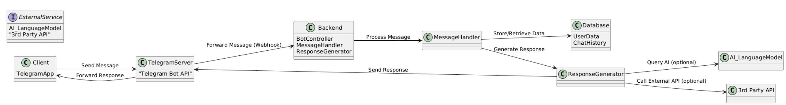
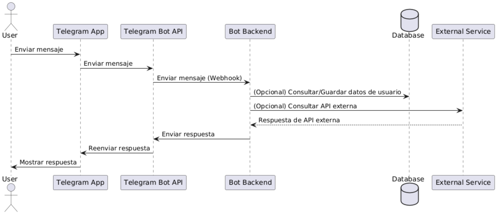

# Interfaces Móviles Conversacionales Basadas en Grandes Modelos de Lenguaje (LLM)

Las interfaces conversacionales en general se han beneficiado en años recientes del desarrollo las arquitecturas modernas de aprendizaje profundo, como la _transformer_, la cual como vimos en clases incorpora mecanismos de atención junto con componentes de codificación y decodificación. Algunos de los modelos de lenguaje más exitosos comercialmente han sido los de OpenAI, incluyendo GPT-3.5, GPT-4 y sus sucesores recientemente lanzados.

Por otro lado, una de las plataformas que permiten desarrollar interfaces conversacionales de manera muy amigable para los desarrolladores es Telegram. Esta plataforma provee un servicio que permite a cualquier desarrollador generar una aplicación de conversación que los usuarios pueden acceder desde su cliente móvil (o de escritorio). 

En este laboratorio demostraremos la facilidad con que es posible actualmente aprovechar una interfaz conversacional móvil potente como la de Telegram, y hacerla operar con un LLM de OpenAI por debajo.

Una pieza importante de nuestra solución es el uso de LangChain. LangChain es una biblioteca diseñada para facilitar la creación de aplicaciones que aprovechan modelos de lenguaje grande mediante una estructura modular y reutilizable. Está pensada para ayudar en aplicaciones avanzadas como chatbots, agentes de búsqueda, generación de texto y respuestas automatizadas, integrando varias funciones clave para manejar el flujo de conversación, la memoria, y la conexión con diversas fuentes de datos. 

## Introducción a los Bots de Telegram



La figura muestra una arquitectura general de chatbot desarrollado con Telegram. La arquitectura integra varios sistemas:

* Client (TelegramApp): Representa la aplicación de Telegram en el dispositivo del usuario. Este cliente envía mensajes y recibe respuestas a través de la interfaz de Telegram.

* TelegramServer (Telegram Bot API): Los mensajes enviados por el cliente de Telegram pasan a través del servidor de Telegram, que los redirige al backend del bot mediante un webhook.

Servidor Backend:

Los desarrolladores deben crear un servidor que reciba las solicitudes de la API de Bot de Telegram y gestione la lógica del bot. Este servidor backend se encarga de recibir mensajes, procesarlos y generar respuestas. Incluye varios componentes, como:

* BotController: Es el componente principal que recibe las solicitudes del servidor de Telegram y maneja la lógica de conexión.
* MessageHandler: Procesa el mensaje recibido, incluyendo la lógica para entender el contexto o el contenido.
* ResponseGenerator: Genera la respuesta adecuada para el mensaje, que puede involucrar consultas a modelos de IA o APIs externas para obtener respuestas específicas.
* Database (opcional): Contiene datos como historial de chats o información de usuarios, lo que permite personalizar las respuestas o mantener un contexto de conversación.
* ExternalService: Representa servicios externos, como un modelo de lenguaje de IA (por ejemplo, GPT-4) o APIs adicionales que el bot puede usar para enriquecer las respuestas.



La interacción entre los componentes es de acuerdo al diagrama en la figura:

1. El Usuario envía un mensaje desde la aplicación de Telegram.
2. La Aplicación de Telegram envía el mensaje a través de la API de Bot de Telegram.
3. La API de Bot de Telegram reenvía el mensaje al Backend del Bot utilizando un webhook (configurado por el desarrollador).
4. El Backend del Bot:
  * Opcionalmente consulta o guarda datos en la Base de Datos para mantener el contexto del usuario o almacenar información relevante.
  * También puede consultar servicios externos (por ejemplo, un modelo de IA o una API de datos).
5. El Backend genera una respuesta y la envía a la API de Bot de Telegram.
6. La API de Bot de Telegram reenvía la respuesta a la Aplicación de Telegram.
7. La Aplicación de Telegram muestra la respuesta al Usuario.

## Crear un Bot de Telegram

Los pasos básicos para crear un bot de Telegram usando _BotFather_ (herramienta de creación de bots) y configurar su entorno inicial:

1. Abre Telegram y busca el usuario BotFather (oficial de Telegram) en la barra de búsqueda.
2. Entra al chat con BotFather y usa el comando `/newbot`.
3. BotFather te pedirá que elijas un nombre para tu bot (este puede tener espacios y caracteres especiales).
4. Luego, elige un nombre de usuario único que termine en "bot" (por ejemplo, `MiBotDeEjemplo_bot`).
5. BotFather te generará un Token de API. Guárdalo bien, ya que lo necesitarás para comunicarte con Telegram a través de su API.

Ahora, puedes configurar el bot en tu ambiente de desarrollo:

Debes instalar las dependencias necesarias en tu entorno de programación. Si usas Python, por ejemplo, puedes instalar python-telegram-bot:

```bash
pip install python-telegram-bot
```

Guarda el token de API en una variable de entorno para mantener la seguridad. Puedes usar un archivo `.env` con bibliotecas como `dotenv` en Python o configurar el token directamente en las variables de entorno de tu sistema.

Ahora, puedes importar las bibliotecas necesarias (como `Application`, `CommandHandler`, y `MessageHandler` de `python-telegram-bot` si usas Python).

Configura el token del bot en la inicialización de la aplicación usando el token que obtuviste de BotFather.

Puedes agregar algunos comandos básicos al bot:

* Define funciones para los comandos comunes (`/start`, `/help`, etc.), que servirán como puntos de entrada para interactuar con el bot.
* Usa los `CommandHandler` para definir qué función ejecutará cada comando en el bot.
* Configura el método de polling para que el bot escuche y responda continuamente. Por ejemplo, en Python puedes ejecutar `application.run_polling()` en el archivo principal.

Para probar el bot, vuelve a la aplicación de Telegram, busca tu bot por su nombre de usuario y envíale un mensaje o un comando para asegurarte de que responde. Con estos pasos tendrás un bot funcional de Telegram que responde a comandos básicos.

## Uso de LLMs con LangChain

LangChain es una biblioteca diseñada para facilitar el desarrollo de aplicaciones que utilizan modelos de lenguaje grandes, tales como GPT, de manera modular y flexible. Esta herramienta permite crear flujos de interacción complejos y escalables, con funciones avanzadas que facilitan la integración de modelos de lenguaje en aplicaciones, especialmente chatbots y agentes conversacionales. LangChain ofrece una infraestructura que permite organizar la interacción con modelos de lenguaje en "cadenas" o secuencias de acciones. Estas cadenas pueden incluir llamadas a modelos de lenguaje, consulta a bases de datos, acceso a APIs externas, y manejo de la lógica de negocio o el flujo conversacional. LangChain cuenta con varios módulos clave:

* Modelos de Lenguaje Integrados: Permite el uso de múltiples LLMs a través de una interfaz unificada, facilitando el cambio entre modelos de distintos proveedores sin necesidad de modificar la lógica.
* Memoria de Conversación: LangChain tiene componentes de memoria para almacenar el contexto de conversaciones largas, permitiendo que el chatbot recuerde información relevante entre interacciones, como el nombre del usuario o los temas discutidos previamente.
* Encadenamiento de Llamadas: LangChain permite crear flujos de trabajo o "cadenas" que combinan diferentes operaciones. Por ejemplo, una cadena podría incluir la interpretación de una consulta del usuario, seguida de una consulta a una base de datos o API externa, y luego la generación de una respuesta personalizada.
* Interacción con Herramientas Externas: LangChain permite que el chatbot use APIs externas, bases de datos y otras herramientas para obtener información adicional y enriquecer las respuestas. Esto es útil, por ejemplo, en chatbots que necesitan consultar datos en tiempo real o acceder a información específica del negocio.
* Agentes Autónomos: LangChain facilita la creación de agentes que pueden realizar tareas de manera autónoma, consultando y tomando decisiones basadas en múltiples fuentes de datos según el contexto.

Considerando todas sus funciones, LangChain es una plataforma versátil para construir chatbots basados en modelos de lenguaje y ofrece múltiples ventajas. Facilita el manejo de contexto, permitiendo que el chatbot mantenga una "memoria" entre turnos, lo que es fundamental en interacciones complejas o prolongadas. La flexibilidad en el flujo conversacional permite estructurar tareas secuenciales y combinar varias operaciones en una sola interacción, mientras que la integración con APIs y servicios externos enriquece al chatbot con datos en tiempo real y funcionalidades avanzadas. Además, la modularidad y escalabilidad de LangChain permiten agregar o modificar funcionalidades sin afectar el resto del código, adaptando fácilmente el chatbot a distintos casos de uso. La plataforma también ofrece personalización avanzada, adaptando respuestas y comportamiento según el contexto, y optimiza costos al controlar cuándo recurrir a modelos avanzados o consultas externas. En conjunto, LangChain posibilita chatbots eficientes, interactivos y altamente personalizados.

La documentación de esta herramienta es accesible en el sitio web oficial de [LangChain en python](https://langchain.com) y cuenta con una estructura bien organizada para usuarios de distintos niveles de experiencia. La [guía introductoria](https://python.langchain.com/docs/get_started/introduction) es un buen punto de partida.

## Bot de este laboratorio

En este laboratorio contamos con un bot de Telegram que utiliza LangChain para integrarse con GPT-4. Este bot ofrece funciones tanto para juegos interactivos como para responder a mensajes contextuales en conversaciones individuales y grupales. La arquitectura es bastante simple, dado que no usa una base de datos y todos los datos de sesiones de usuario se mantienen en memoria del proceso.

El bot es implementado mayormente en ´bot.py´ y se compone por las siguientes funciones:

* `main`: Configura el bot y los comandos disponibles, inicializando el sistema de respuesta para los comandos `/start`, `/juegos`, `/rendirse`, y para mensajes de texto generales. Ejecuta el bot utilizando polling.
* `start`: Responde al comando `/start`, enviando un mensaje de bienvenida y una instrucción sobre el uso del comando `/juegos` para ver los juegos disponibles.
* `get_memory_key`: Genera una clave única para cada usuario o grupo en función de los IDs de chat y usuario. Esto permite almacenar el historial de conversación por chat o usuario, diferenciando entre interacciones privadas y de grupo.
* `surrender`: Responde al comando `/rendirse`, revisando si hay un juego activo en el chat. Si lo hay, muestra el resultado final con la palabra correcta y actualiza el historial del chat. Si no hay un juego activo, notifica que no hay juegos en curso.
* `list_games`: Responde al comando `/juegos` y presenta una lista de juegos disponibles, utilizando botones interactivos en un teclado inline. Al seleccionar un juego, se actualiza el historial de chat con la elección del usuario.
* `button_handler`: Maneja las respuestas de los botones inline (por ejemplo, elegir un juego). Si el usuario selecciona “Ahorcado”, inicia un nuevo juego de ahorcado, actualiza el estado del juego y muestra el progreso de la palabra a adivinar.
* `handle_message`: Gestiona los mensajes de texto que no son comandos, verificando si hay un juego activo. En el caso de “Ahorcado”, comprueba si el mensaje es una letra válida, actualiza el juego y el historial, y envía un mensaje de respuesta con el estado del juego. Si el juego termina, muestra un mensaje de felicitación o pérdida y cierra el juego. Si no hay un juego activo, el bot responde en función de su historial y contexto de la conversación, especialmente en chats grupales si el bot es mencionado.

El bot permite conversaciones casuales sin restringirse a un tema en particular, e implementa un par de juegos.

## Desafíos

1. Modifica el juego actual para que la palabra a utilizar sea seleccionada por el LLM. Puedes hacer que `bot.py` muestre en consola la palabra seleccionada para la sesión (`memory_key`).
2. En la misma línea que el huego del ahorcado, agrega al chatbot un juego de adivinanzas, en donde el chatbot dé al usuario la descripción de un objeto y espere que el usuario lo pueda identificar. El usuario puede pedir al chatbot pistas.
3. Investiga cómo podrías agregar una botonera para elegir el idioma con el cual interactuar con el bot, y que todos los mensajes tengan el idioma seleccionado.
4. Mejora el chatbot utilizando una base de datos no relacional (Redis) para mantener el estado de las sesiones.
